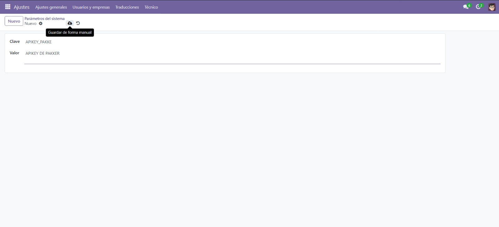

# Nombre del modulo
parcel

# Descripción
Este modulo brinda una optimización en el proceso de realizar envios por medio de la paqueteria PAKKE en el modulo de orders_control de una instancia de odoo17, la forma en que mejora el proceso es haciendo uso de la api de PAKKE al hacer esto se conecta el modulo anterirormnete dicho con la pagina de PAKKE para poder registrar envios, realizar cotizaciones y imprimir guias de envios.

# Requisitos
- Odoo17
- Python 3.12.2
- ApiKey de paga de la api de PAKKE

# Colocar la APIKEY en los parametros del sistema
- Ir al apartado de ajustes

- Dar clic en parametros del sistema en la sección de parametros dentro de Técnico

- Dar clic en el boton de Nuevo, en el campo clave colocar APIKEY_PAKKE y en el valor colocar la APIKEY correspondiente y dar en el boton de guardar cambios

# Uso
## Realizar cotización
- Dirigirse al modelo de order_control entrar en un registro y dar clic en la pestaña de Datos de cotizaciones

- Rellenar los datos solicitados y presionar el boton de cotizar

- Dar clic en la pestaña cotizar para ver las cotizaciones realizadas

## Realizar una guia de envio
- Hacer los pasos de realizar una cotización
- Seleccionar un mensajero dando clic al boton de Seleccionar y presionar el boton de Generar Guia

- Descargar la guia de envio presente en el chatter
